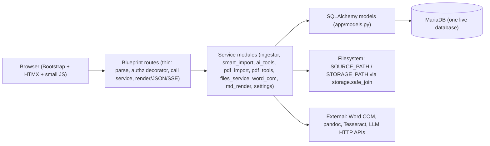

# Architecture

> Read after [OVERVIEW.md](OVERVIEW.md) and [STATUS.md](STATUS.md). This file describes structure on disk, layering, request/data flow, and where new code goes. Module-level detail is in `docs/modules/`.

## On disk

```
D:\oqb2\
  run.py                 dev server entry: create_app().run(0.0.0.0:5000, debug=True)
  init_db.py             create_all + seed subjects/admin  (LIVE DB - do not run casually)
  cli.py                 click CLI: ingest | sync | migrate-storage
  migrate_*.py           one-off historical migrations (superseded by boot patches)
  import_dse_p2.py, tag_topics.py, debug_env.py, test_db.py   one-off / diagnostic scripts
  requirements.txt, .env (secret, untracked), .env.example
  app/
    __init__.py          app factory: extensions, blueprints, boot schema patches, settings.load_all
    config.py            Config class: .env bootstrap defaults + build_database_uri()
    models.py            ALL SQLAlchemy models (schema source of truth)
    utils.py             authz decorators, VERSIONS, username policy, multi-sort helpers
    settings.py          System Settings REGISTRY + load/get/set/reset (DB-backed tunables)
    storage.py           STORAGE_PATH tree, safe_join, per-user dirs
    auth.py dashboard.py generator.py user.py admin.py files.py pwa.py   blueprints
    toolbox/             toolbox_bp: __init__ (hub), pdf.py (PDF Tool), markup.py (PWA), common.py
    files_service.py     pure filesystem ops + RootRegistry (user/admin scopes)
    ingestor.py smart_import.py            ingestion engine + heuristic folder import
    word_com.py doc_thumbnails.py batch_image_gen.py   Word COM merge/PDF, DOC thumbnails, DOC/MD -> IMG
    md_render.py         Markdown -> sanitised HTML
    llm_client.py ai_tools.py ai_prompts.py parallel.py   LLM transport, AI batch ops, prompt registry
    pdf_import.py pdf_layout.py pdf_tools.py pdf_text.py  PDF import detection, CV helpers, PDF Tool ops, Find & Mark
  templates/             Jinja2; base.html layout; admin_*.html; partials/ for HTMX + shared modals
  static/                img/ (logos), markup/ (PWA manifest, sw.js, icon); css/ js/ are empty placeholders
  resources/mcq_answer_img/{A,B,C,D}.png   source PNGs for the Set MCQ ANS batch op
  tests/                 unittest modules (see docs/core/01-runtime-and-ops.md)
  docs/                  agent-first documentation (see OVERVIEW.md documentation map)
  .cursor/rules/         Cursor rules (session bootloader)
  output/                legacy OUTPUT_PATH fallback for pre-migration generated files (gitignored)
```

External data (not in the repo): `SOURCE_PATH` (question assets, read-mostly) and `STORAGE_PATH`
(`Shared/`, `System/`, `User/<username>/generated/`). Paths come from `.env`; on the current host they
are `D:\oqb_data\Source` and `D:\oqb_data\Storage`. See [docs/core/05-storage-and-paths.md](docs/core/05-storage-and-paths.md).

## Layering



- **Routes are thin.** They extract params, enforce authz via a decorator from `app/utils.py`, call a service or query, and return a template / partial / JSON / SSE stream. The historical exception is `app/admin.py` (~7.3k lines) where many routes still hold logic inline; when you touch one, move logic into the relevant service module rather than adding more.
- **Services own business logic** and are importable without a request (they take explicit args and, when run in a thread, an `app.app_context()`).
- **Models are plain SQLAlchemy** with a few permission helpers on `User`. No repository layer.
- **Templates render server-side.** HTMX requests (header `HX-Request`) return a partial from `templates/partials/`; the same route renders a full page otherwise. Shared JS helpers live in `base.html` (see [docs/frontend/conventions.md](docs/frontend/conventions.md)).

## Request and data flow (typical)

1. `create_app()` (`app/__init__.py`): load `.env`, build DB URI, init `db` + `login_manager`, register 8 blueprints, inject `OQB_VERSIONS` into templates, ensure storage tree, mark stale `GeneratedFile` rows failed, run **idempotent boot schema patches**, seed prompt variants, then `settings.load_all(app)` overlays DB-backed tunables onto `app.config`.
2. A request hits a blueprint route; `@login_required` + an authz decorator gate it; `subject_id` is extracted from URL kwargs, query, form, or JSON body.
3. Dashboard filtering: `POST /dashboard/filter` builds a SQLAlchemy query, then sorts **in Python** with `apply_multi_sort` (natural sort, NULL handling, manual block order) and paginates; returns `partials/question_list.html`.
4. Generation: `POST /generate` records a `GeneratedFile` (`pending`) and spawns a background thread that builds the `.docx` (python-docx + docxcompose; DOC slots merged natively through Word COM under a global lock), writes to `User/<name>/generated/`, and flips status to `completed`/`failed`. The page polls `GET /generate/status/<id>`. PDF is produced lazily on request via Word `ExportAsFixedFormat`.
5. Long admin batch operations (ingest, sync, batch IMG, AI check/generate/solve/tag, MCQ ANS) stream **SSE** (`text/event-stream`, events `{type, message, current?, total?}`, `type='done'` ends the stream) and support a server-side cancel registry where documented.

## Conventions you must follow

- Authz at the edge, scoping inside: see [docs/core/02-auth-and-permissions.md](docs/core/02-auth-and-permissions.md).
- JSON responses, SSE shape, `subject_id` extraction, QID and VERSIONS handling, sort fields: [docs/core/04-backend-conventions.md](docs/core/04-backend-conventions.md).
- Schema changes = model edit + boot patch + `docs/core/03` + `docs/reference/schema-history.md`: [docs/core/03-data-model-and-migrations.md](docs/core/03-data-model-and-migrations.md).
- Tunables: registry entry + `Config` default + read through `current_app.config`: [docs/core/06-system-settings.md](docs/core/06-system-settings.md).
- Files: only under a registered root, only via `safe_join`, only served through routes: [docs/core/05-storage-and-paths.md](docs/core/05-storage-and-paths.md).
- Frontend: reuse shared partials/helpers, HTMX targets by id, SortableJS config: [docs/frontend/conventions.md](docs/frontend/conventions.md).

## Where new code goes

| You are adding... | Put it in | Also update |
|---|---|---|
| A new page or JSON route in an existing area | that area's blueprint file (`app/<area>.py`); template in `templates/` | module doc Routes table; STATUS frontend table if it is a page; nav in `templates/base.html` if it needs a link |
| A new bounded feature area | new `app/<area>.py` blueprint (register in `app/__init__.py`) + `app/<area>_service.py` if logic is non-trivial | new `docs/modules/<area>.md` from the template, STATUS row, OVERVIEW area map, a scoped rule if it has invariants |
| A new model / column | `app/models.py` + idempotent patch in `create_app()` | `docs/core/03`, `docs/reference/schema-history.md`, module doc Tables |
| A new tunable | `app/settings.py` REGISTRY + `app/config.py` default + `.env.example` comment | `docs/core/06` table |
| A new shared UI behaviour | `templates/base.html` helper or a `templates/partials/*.html` | `docs/frontend/conventions.md` |
| A new long-running admin op | SSE generator in a service module + route in `app/admin.py` following the existing contract | module doc Background work section |
| A new LLM-backed feature | prompt key in `app/ai_prompts.PROMPTS_REGISTRY`, worker in `app/ai_tools.py`, default-LLM setting `<FEATURE>_DEFAULT_LLM` | `docs/modules/ai-tools.md`, `docs/modules/ai-prompts.md`, `docs/core/06` |
| A test | `tests/test_<module>.py` using `unittest`; avoid `create_app()` (it touches the live DB) unless unavoidable | `docs/core/01` if the run ritual changes |

## Known structural hazards

- `app/admin.py` is very large and mixes many features; `app/ai_prompts.py`, `app/ai_tools.py`, `app/generator.py`, `app/user.py` are also >1.5k lines. Read only the region you need; grep for the route name first.
- `create_app()` has side effects on the live DB and filesystem on every start (see [`.cursor/rules/safety-ops.mdc`](.cursor/rules/safety-ops.mdc)).
- Word COM is a single global resource; concurrent generation/thumbnail jobs serialise on a lock with `WORD_COM_LOCK_TIMEOUT`.
- Multi-worker WSGI would break System Settings hot-reload and the in-process SSE cancel registry; the app is deployed single-process today.
