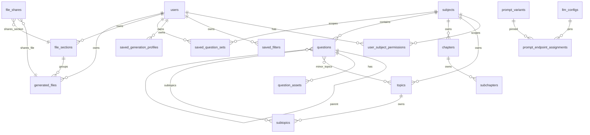

# 03 — Data model and schema migrations

> `app/models.py` is the schema source of truth; read it directly when in doubt. This file gives you the map, the constraints that are easy to violate, and the **only** sanctioned way to change the schema (there is no Alembic — [ADR-002](../decisions/ADR-002-no-migration-framework-boot-patches.md)).

## Entity map



## Tables

| Model | Table | Purpose | Constraints and notes |
|---|---|---|---|
| `User` | `users` | Login + `is_super_admin` | `is_admin` is legacy, ignore it. Helpers: [02-auth-and-permissions.md](02-auth-and-permissions.md) |
| `UserSubjectPermission` | `user_subject_permissions` | `role` ∈ `viewer` / `user` / `admin` per subject | unique `(user_id, subject_id)` |
| `Subject` | `subjects` | `id` is a **string PK** (`MATC`), `name`; `split_parts_default` bool (default false) | `id` is embedded in QIDs and the `SOURCE_PATH/<id>/` layout → immutable. Topics/chapters cascade on delete; delete is blocked while questions reference it (see [../modules/admin-panel.md](../modules/admin-panel.md)). `split_parts_default` is on the Subjects form and seeds the PDF-import split checkbox. |
| `Topic` / `Subtopic` | `topics` / `subtopics` | Curriculum tagging; `sort_order`; `Subtopic.hidden` | Subtopics cascade from topic |
| `Chapter` / `Subchapter` | `chapters` / `subchapters` | Textbook organisation; `sort_order`; `Subchapter.hidden` | `questions.chapter_id/subchapter_id` are `ON DELETE SET NULL` |
| `Question` | `questions` | One logical question (standalone, stem, or part) | `qid` unique (the only identity — `(subject, source, year, paper, qno)` is **not** unique). `subject`, `source` (`DSE/CE/AL/QB`), `year` (NULL for QB), `paper`, `section`, `qno` int (start of the QNO token), `qno_end` (inclusive end of a range stem; NULL otherwise), `parent_id` self-FK `ON DELETE RESTRICT` (NULL = root), `part` (own label `a`/`i`, not the full path), `part_sort` (letter 1–26, roman 101–110), `q_type` (`MC/CQ`/NULL), `level` 1–3/NULL, `major_topic_id`, `major_subtopic_id` (must belong to major topic — enforced in code, not DB), `chapter_id`, `subchapter_id`, `description`, `correct_percentage` 0–100, `answer` text, `comment`, `verified/verified_at/verified_by`, `created_at`. Relationships `parent` / `children`. M2M `minor_topics` (`question_minor_topics`), `subtopics` (`question_subtopics`). Grammar: [../modules/question-hierarchy.md](../modules/question-hierarchy.md) |
| `QuestionAsset` | `question_assets` | One file slot | `asset_type` enum `QUE/ANS/SOL`; `file_format` enum `IMG/DOC/MD`; `version` enum `EN/CH/BI/ENO/CHO`; `file_path` forward-slash relative to `SOURCE_PATH`; `part_number` ≥ 1 (IMG multi-part only; DOC and MD are single-slot). **Unique `(question_id, asset_type, version, file_format, part_number)`**. AI check fields: `check_state` (NULL/`checking`/`ok`/`issues`/`error`), `check_result` JSON, `check_raw`, `checked_at` — per format (IMG parts share one state) |
| `SavedFilter` | `saved_filters` | Dashboard search profile | `filter_data` JSON (includes `subject`, `sort_group_order`), `is_starred`, `is_shared` |
| `SavedGenerationProfile` | `saved_generation_profiles` | Generation options preset | `options_data` JSON (no question ids) |
| `SavedQuestionSet` | `saved_question_sets` | Named list of `Question.id` per subject | `question_ids` JSON list materialised at save; FK `subject` without cascade |
| `FileSection` | `file_sections` | My Files folder | unique `(user_id, name)`; exactly one `is_default` per user (lazy-created); `sort_field` ∈ `name/created_at/completed_at/question_count/manual` |
| `GeneratedFile` | `generated_files` | Generated doc job + file | `status` `pending → generating → completed | failed`; `filter_data`, `generation_options` JSON; `section_id` `ON DELETE SET NULL`; `manual_position` |
| `FileShare` | `file_shares` | Share a file or a section with a user | CHECK exactly one of `file_id`/`section_id`; unique per target; CASCADE from file/section |
| `SystemSetting` | `system_settings` | Runtime tunable overrides | `key` PK, `value` JSON-encoded text; also holds the non-registry `FILE_BROWSER_EXTRA_ROOTS` list. See [06-system-settings.md](06-system-settings.md) |
| `LLMConfig` | `llm_configs` | LLM endpoint | `name` unique; `api_key_enc` Fernet; `kind` `local/cloud`; `max_concurrency`; `service_tier(_batch)`; `api_protocol` `chat/responses`; reasoning fields; `request_extra_json`. See [../modules/ai-tools.md](../modules/ai-tools.md) |
| `PromptVariant` | `prompt_variants` | Named prompt versions per key | unique `(prompt_key, name)`; one `is_builtin` (content NULL = registry default) and one `is_active` per key |
| `PromptEndpointAssignment` | `prompt_endpoint_assignments` | Pin endpoint → variant per key | unique `(prompt_key, endpoint_id)`; CASCADE both FKs |
| `PromptOverride` | `prompt_overrides` | **Legacy**; migrated into built-in variants at boot | Do not write new rows |

JSON-in-text columns (`filter_data`, `options_data`, `question_ids`, `generation_options`, `check_result`, `system_settings.value`) are parsed in Python; keep them backward compatible — old blobs are never migrated.

## Invariants the DB does not enforce

- `major_subtopic_id` must belong to `major_topic_id` (checked in the tag-editor save path).
- `SavedFilter.filter_data['subject']` is the only link between a saved filter and a subject (no FK) — subject deletion scans JSON to clean up.
- `Question.subject` must equal the `SUBJ` token in `qid`. `qno` is the integer **start** of the QNO token (`Q5` / `Q5a` / `Q23-24` → 5); `qno_end` and `part` hold the rest. Source of truth: `app/hierarchy.py`, not a second regex.
- Exactly one default `FileSection` per user; the code lazily creates it.
- `PromptVariant`: exactly one active row per key — enforced by the admin routes and `ensure_seeded()`.

## How schema changes are made (the only sanctioned way)

1. Edit the model in `app/models.py`.
2. Add an **idempotent boot patch** in `create_app()` (`app/__init__.py`) next to the existing ones:
   - New table: `Model.__table__.create(db.engine, checkfirst=True)`.
   - New column / index / enum widening: query `INFORMATION_SCHEMA.COLUMNS` for `TABLE_SCHEMA = DATABASE() AND TABLE_NAME = ...`, and only `ALTER TABLE` when the column is missing (or the enum lacks the value). Wrap in `try/except Exception: pass` like the neighbours so a broken DB still boots.
   - Back-fills go in the same block, guarded by the same "was just added" flag.
3. Record the change in [../reference/schema-history.md](../reference/schema-history.md) and update the table above and the module doc's Tables section.
4. Do **not** write a new `migrate_*.py`; those three root scripts are historical and superseded by the boot patches. Do not introduce Alembic without an ADR.
5. Remember the patch runs against the **live** database the next time anything calls `create_app()` (server reload, `cli.py`, some tests). Test the SQL mentally for MariaDB syntax; you cannot rehearse it on a copy unless the user provides one.

Example (existing pattern, `questions.verified`):

```python
with db.engine.begin() as conn:
    existing = {row[0] for row in conn.execute(text(
        "SELECT COLUMN_NAME FROM INFORMATION_SCHEMA.COLUMNS "
        "WHERE TABLE_SCHEMA = DATABASE() AND TABLE_NAME = 'questions'"))}
    if 'verified' not in existing:
        conn.execute(text("ALTER TABLE questions ADD COLUMN verified TINYINT(1) NOT NULL DEFAULT 0"))
```

## Data operations

| Operation | Tool | Safety |
|---|---|---|
| Ingest files → rows | `python cli.py ingest` or Admin → Smart Import | Additive upsert; safe |
| Remove rows whose files vanished | `python cli.py sync` (dry-run) / `--no-dry-run`; Admin → Health → Sync | Destructive with `--no-dry-run`; 24-hour grace on newly created questions; never drops a row that still has children |
| Storage relocation | `python cli.py migrate-storage` | Idempotent; skips existing targets |
| Fresh install | `python init_db.py` | Only on an empty DB |
| Backup / restore | `mysqldump` + file copies | See [01-runtime-and-ops.md](01-runtime-and-ops.md) |

## Lifecycle-scoped data

OQB2 has **no rollover period** (no academic-year reset). Questions accumulate; `year` is a tag, not a partition. Per-user data (files, sections, filters, presets, sets) lives until the user or a super admin deletes it. If you introduce anything period-scoped, add its carry/reset behaviour here and in the module doc before calling it done.
